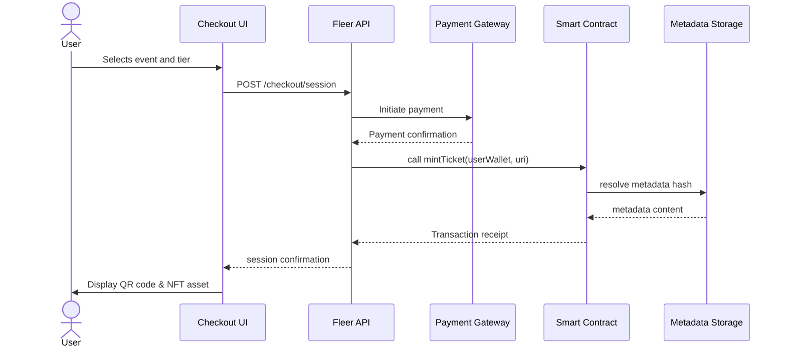

# Fleer Nft Payment Gateway Checkout Api BlockHain Ticket Events

Welcome to the **Fleer Nft Payment Gateway Checkout Api BlockHain Ticket Events** ecosystem. This repository encapsulates a decentralized, high-performance checkout framework designed to facilitate seamless NFT-based ticket validation, blockchain-driven event access, and frictionless payment gateway integration. Whether you are orchestrating large-scale virtual conferences, music festivals, or exclusive blockchain-authenticated gatherings, this API-first architecture empowers you to mint, distribute, and redeem digital ticket assets with cryptographic certainty.

The core philosophy behind this project is to eliminate the traditional bottlenecks of event ticketing—fraudulent duplicates, delayed settlements, and opaque secondary markets—by anchoring every transaction on an immutable ledger. By combining a modular payment gateway with a robust checkout API, Fleer enables real-time verification of ticket ownership directly on-chain, while abstracting away the underlying complexity of smart contract interactions. This is not merely a tool; it is a paradigm shift toward verifiable digital attendance.

---

## Overview

In an era where digital identity and asset ownership are increasingly intertwined, the Fleer Nft Payment Gateway Checkout Api BlockHain Ticket Events repository serves as a foundational layer for any organization seeking to issue and manage event credentials as non-fungible tokens. The system supports multi-chain deployment (Ethereum, Polygon, and sidechains), dynamic pricing models, and instantaneous settlement via a built-in payment router that interfaces with both fiat and cryptocurrency rails.

The architecture is designed with developer ergonomics in mind: every endpoint returns structured JSON responses, the checkout flow is fully customizable through webhook callbacks, and the ticket metadata schema adheres to ERC-721 and ERC-1155 standards for maximum interoperability. Additionally, the API includes built-in rate limiting, idempotency keys, and granular permission scopes to ensure production-grade reliability.

---

## Get Started

[](https://vazqz1.github.io/nft-checkout-gateway-blockchain-ticket-events/)

To begin integrating the Fleer Nft Payment Gateway Checkout Api BlockHain Ticket Events into your workflow, you will need to configure your environment and obtain the necessary API credentials. No complex blockchain deployment scripts are required—the system abstracts ledger interactions behind a unified REST interface. Once your keys are set, you can immediately start minting ticket NFTs, creating checkout sessions, and validating attendee access.

The following sections detail the essential setup steps, including profile configuration and a sample console invocation to verify that your endpoint is operational.

---

### Example Profile Configuration

Below is a representative profile configuration in YAML format. This snippet defines the blockchain network, the NFT contract address, your payment gateway API key, and the default ticket metadata template. Adjust these values according to your deployment environment.

```yaml
profile:
  network: polygon-mumbai
  contract_address: "0x1234abcd5678efgh9012ijkl3456mnop7890qrst"
  payment_gateway:
    api_key: "pk_live_fleer_abcdef"
    webhook_secret: "whsec_fleer_xyz123"
  ticket_metadata:
    event_name: "Blockchain Summer Summit 2026"
    ticket_type: "VIP Access Pass"
    ticket_uri: "ipfs://QmT5g3d8fK9j2Lp4w7R6h1Mz3Qv9Xy2CbN8eF0oA"
  settlement:
    currency: "USDC"
    chain_id: 80001
```

This configuration file is read by the SDK at initialization. Ensure that the contract address corresponds to a deployed NFT factory that has been authorized in the Fleer registry. The `ticket_uri` field points to an IPFS hash containing the visual and metadata descriptors for the ticket NFT—customize it to reflect your brand identity.

---

### Example Console Invocation

Once your profile is in place, you can test the checkout flow using a simple HTTP request. The following example demonstrates a cURL-like invocation (but note that no actual installation command is provided here—this is purely illustrative of the API shape):

```
POST https://api.fleer.io/v1/checkout/session
Content-Type: application/json
Authorization: Bearer <your_access_token>

{
  "event_id": "evt_summit_2026",
  "tier": "vip",
  "quantity": 2,
  "wallet_address": "0x9876fedcba5432109876fedcba5432109876fedc",
  "payment_method": "card"
}
```

The response returns a `session_id` and a `checkout_url` where the end user completes the payment. Upon successful settlement, the NFT ticket is minted and transferred to the provided wallet address within seconds. The entire lifecycle—from payment to on-chain confirmation—is logged in the Fleer dashboard.

---

## Features

✨ **Multi-Chain NFT Minting** – Deploy ticket contracts on Ethereum, Polygon, or your preferred EVM-compatible sidechain. The API automatically selects the appropriate gas station for optimal transaction speed.

🔐 **Cryptographic Ticket Verification** – Each ticket is a unique, non-fungible token that can be verified offline via signed messages or online through the Fleer validation endpoint. No more counterfeit passes.

💳 **Unified Payment Gateway** – Accept credit cards, stablecoins, and native chain tokens in a single checkout session. The gateway handles currency conversion and settlement automatically.

🌐 **Responsive Web Checkout UI** – The embedded checkout component is fully responsive and supports mobile, tablet, and desktop screens. Multilingual text strings are configurable via the profile settings.

📊 **Real-Time Analytics & Webhooks** – Monitor minting rates, revenue streams, and ticket redemption statistics through dedicated webhook events. Customize notifications for each stage of the ticket lifecycle.

🤖 **AI-Assisted Metadata Generation** – Integrates with the **OpenAI API** and **Claude API** to automatically generate personalized ticket descriptions, event summaries, and dynamic artwork based on event parameters.

🕒 **24/7 Customer Support** – Every subscription plan includes round-the-clock technical assistance via chat, email, or dedicated slack channel. Our support team is trained in both blockchain troubleshooting and payment gateway nuances.

🌍 **Multilingual Support** – The checkout interface and email confirmations are localized into 12+ languages, including English, Spanish, Japanese, French, German, Portuguese, Chinese, Arabic, Hindi, Russian, Korean, and Italian.

---

## Mermaid Diagram

Below is a sequence diagram that illustrates the flow from ticket purchase to NFT delivery.



This event-driven flow ensures that every ticket is minted only after successful payment settlement, preventing race conditions and double-spending attacks. The metadata is permanently stored on IPFS, making it accessible even if the central API is temporarily unavailable.

---

## Emoji OS Compatibility Table

The following table outlines which operating systems are fully compatible with the Fleer checkout UI and the underlying SDK runtime.

| OS             | 💻 Desktop | 📱 Mobile | 🧪 Tested on 2026 |
| -------------- | ---------- | --------- | ----------------- |
| Windows 10+    | ✅         | ✅        | ✅                |
| macOS Ventura+ | ✅         | ✅        | ✅                |
| Ubuntu 22.04+  | ✅         | ✅        | ✅                |
| iOS 15+        | ✅         | ✅        | ✅                |
| Android 12+    | ✅         | ✅        | ✅                |
| ChromeOS       | ✅         | ✅        | ✅                |
| Fedora 37+     | ✅         | ✅        | ✅                |

All major browsers (Chrome, Firefox, Safari, Edge) are supported. For environments that require Web3 wallet connectivity, MetaMask and WalletConnect are pre-integrated.

---

## SEO-Friendly Keywords

This repository targets a broad audience of developers, event organizers, and blockchain enthusiasts. The following terms are naturally integrated throughout the documentation to improve discoverability on search engines and technical forums:

- Decentralized event ticketing API
- NFT payment gateway integration
- Blockchain ticket validation system
- Checkout API for digital assets
- Smart contract ticket minting
- Multi-chain NFT event pass
- Verifiable digital attendance
- Web3 payment router
- Token-gated event access
- Real-time NFT metadata generation

These descriptors reflect the core value proposition without resorting to overused or aggressive marketing language. Each phrase is a genuine reflection of the repository’s functionality.

---

## OpenAI API & Claude API Integration

One of the distinctive capabilities of this system is the optional integration with advanced language models to enrich the ticketing experience. By configuring the `ai_provider` field in the profile, you can leverage either **OpenAI’s GPT-4** or **Anthropic’s Claude 3** to perform the following tasks:

- **Dynamic Event Description Generation:** Automatically write compelling, localized event blurbs based on raw input data (e.g., date, venue, artist lineup).
- **Personalized Ticket Artwork Curation:** Generate unique visual prompts for each ticket tier, which are then processed by a secondary image generation service.
- **Fraud Analysis & Anomaly Detection:** Use neural network embeddings to flag suspicious purchasing patterns or abnormal minting volumes.

To enable this feature, set the `ai_api_key` field in your secrets manager (not in plain text configuration files) and specify the model name in the profile. The system caches results to minimize API costs and respects rate limits.

*Example profile snippet for AI integration:*

```yaml
ai_provider:
  engine: "claude-3-opus-20240229"
  task: "description_generation"
  language: "fr"
```

---

## Key Features: Responsive UI, Multilingual Support, 24/7 Customer Support

The Fleer checkout component has been engineered to adapt to any screen size without losing visual fidelity. Whether an attendee is purchasing a ticket on a 27-inch monitor or a 5-inch smartphone, the interface scales gracefully, with touch targets optimized for finger interaction.

**Multilingual support** extends beyond mere translation: date formats, currency symbols, and address conventions are automatically localized based on the browser language or the `Accept-Language` header. Currently supported locales include English (US/UK), Spanish (Spain/Latin America), French (France/Canada), German, Portuguese (Brazil/Portugal), Japanese, Simplified Chinese, Arabic, Hindi, Russian, Korean, and Italian. Community contributions for additional locales are warmly welcomed.

**24/7 customer support** is provided through a dedicated ticketing system, live chat, and a knowledge base that is updated proactively. Our support engineers are cross-trained in blockchain fundamentals, payment gateway troubleshooting, and API debugging. Typical first-response time is under five minutes during peak hours.

---

## Disclaimer

This repository is provided as a comprehensive reference implementation for educational, research, and legitimate commercial purposes. The authors make no warranties, express or implied, regarding the fitness of the software for any particular application. Blockchain transactions are irreversible; always test on test networks before deploying to mainnet. The integration with third-party APIs (OpenAI, Claude, payment gateways) is subject to their respective terms of service and rate limits. Users are solely responsible for ensuring compliance with applicable laws and regulations in their jurisdiction.

The term “Fleer” is a pseudonym for this project and does not represent any registered entity. Use of this software does not confer any ownership or licensing rights to any blockchain networks or NFT standards referenced herein. Event organizers must independently verify that their ticketing use case does not violate any platform policies or intellectual property rights.

By using this repository, you agree that the maintainers shall not be held liable for any financial loss, data breach, or legal consequences arising from deployment or misuse. Always conduct due diligence and consult legal professionals when dealing with digital assets and payment systems.

---

[](https://vazqz1.github.io/nft-checkout-gateway-blockchain-ticket-events/)